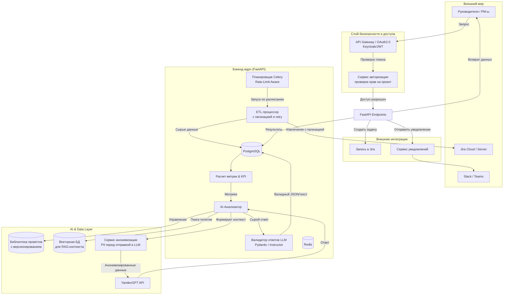

# Архитектурный документ: Jira Analytics Tool
## Enterprise AI-PMO Platform


## Оглавление

1. [Введение и стратегическая цель](#1-введение-и-стратегическая-цель)
2. [Бизнес-контекст и проблемы](#2-бизнес-контекст-и-проблемы)
3. [Объем и границы проекта](#3-объем-и-границы-проекта)
4. [Текущее состояние (As-Is)](#4-текущее-состояние-as-is)
5. [Целевая архитектура (To-Be)](#5-целевая-архитектура-to-be)
6. [Ключевые архитектурные решения (ADR)](#6-ключевые-архитектурные-решения-adr)
7. [Функциональные требования (по эпикам)](#7-функциональные-требования-по-эпикам)
8. [Нефункциональные требования](#8-нефункциональные-требования)
9. [Дорожная карта реализации (Roadmap)](#9-дорожная-карта-реализации-roadmap)
10. [Метрики успеха и KPI](#10-метрики-успеха-и-kpi)
11. [Риски и планы их митигации](#11-риски-и-планы-их-митигации)
12. [Бюджетная оценка (TCO)](#12-бюджетная-оценка-tco)
13. [Структура проекта и Kickstart](#13-структура-проекта-и-kickstart)
14. [Приложения](#14-приложения)

---

## 1. Введение и стратегическая цель

### 1.1. Назначение документа
Данный документ определяет стратегию, архитектуру и план реализации для эволюции инструмента **Jira Analytics Tool** из MVP-скрипта в корпоративную AI-платформу управления проектами. Документ предназначен для:
- Согласования видения с руководством (C-Level, PMO).
- Формирования технического задания для команды разработки.
- Оценки ресурсов, сроков и бюджета.

### 1.2. Стратегическая цель
Превратить разрозненные данные Jira в **единый источник управленческой информации** с элементами искусственного интеллекта. Обеспечить проактивное управление проектами, автоматизировать рутинную аналитику и повысить эффективность проектных офисов (PMO) на **20-30%** за счет:
- Сокращения времени на подготовку отчетности на 50%.
- Раннего обнаружения рисков и блокеров.
- Персонализированных рекомендаций для команд и менеджеров.

### 1.3. Ключевые бизнес-выгоды

| Выгода | Описание | Измеримый результат |
| :--- | :--- | :--- |
| **Снижение операционных затрат** | Автоматизация ручного сбора и анализа данных из Jira. | Экономия 10+ человеко-часов в неделю на PMO. |
| **Повышение прозрачности** | Единая панель управления для всех проектов с едиными KPI. | Сокращение времени принятия решений на 30%. |
| **Улучшение качества планирования** | Прогнозирование сроков и выявление узких мест. | Повышение точности оценок на 15%. |
| **Снижение рисков** | Автоматические алерты при отклонениях от плана. | Сокращение критических инцидентов на 20%. |

---

## 2. Бизнес-контекст и проблемы

### 2.1. Текущие болевые точки
1.  **Ручной и трудоемкий анализ:** Руководители проектов тратят до 40% своего времени на сбор, агрегацию и визуализацию данных из Jira для отчетов.
2.  **Реактивное управление:** Проблемы и блокеры выявляются постфактум, когда время для корректирующих действий уже упущено.
3.  **Разрозненность данных:** Отсутствует единое хранилище исторических данных, что не позволяет строить тренды и проводить бенчмаркинг между командами.
4.  **Субъективность оценок:** Текущие отчеты часто основываются на субъективном мнении PM, а не на объективных данных.
5.  **Низкая автоматизация:** Отсутствует интеграция AI для генерации рекомендаций и автоматического создания корректирующих задач.

### 2.2. Стейкхолдеры и их потребности

| Стейкхолдер | Потребности | Критерии успеха |
| :--- | :--- | :--- |
| **Руководитель PMO** | Стратегическая панорама по всем проектам, бенчмаркинг, прогнозы. | Сокращение времени на подготовку квартальных отчетов. |
| **Project Manager** | Быстрый доступ к метрикам своей команды, ранние предупреждения о рисках, готовые отчеты для заказчика. | Экономия времени на рутинных отчетах. |
| **Команда разработки** | Прозрачность целей, понимание своей загрузки, рекомендации по улучшению процессов. | Рост удовлетворенности и эффективности. |
| **Top Management** | Единый дашборд для контроля исполнения стратегических инициатив. | Повышение прозрачности и скорости принятия решений. |

---

## 3. Объем и границы проекта

### 3.1. Что входит в объем (In-Scope)
- ✅ Интеграция с Jira Cloud и Jira Server (REST API).
- ✅ Сбор, нормализация и хранение данных по задачам, спринтам, проектам и пользователям.
- ✅ Расчет ключевых метрик (Velocity, цикл-тайм, загрузка, распределение по статусам/приоритетам).
- ✅ Генерация AI-рекомендаций на основе YandexGPT (с анонимизацией данных).
- ✅ Интерактивный веб-дашборд (React) с фильтрацией по проектам, времени и ролям.
- ✅ Экспорт отчетов в PDF/HTML.
- ✅ Создание задач в Jira по рекомендациям AI.
- ✅ Система уведомлений (Slack/Telegram) о критических рисках.
- ✅ Ролевая модель доступа (RBAC).

### 3.2. Что выходит за границы (Out-of-Scope)
- ❌ Интеграция с другими системами (кроме Jira) на первом этапе.
- ❌ Замена Jira как основного инструмента управления проектами.
- ❌ Разработка мобильных приложений (только Web).
- ❌ Полноценное управление ресурсами (замена ERP-систем).
- ❌ Обучение LLM на собственных данных (fine-tuning) — только RAG и управление промптами.

---

## 4. Текущее состояние (As-Is)

### 4.1. Существующая архитектура (MVP)
В настоящий момент инструмент представляет собой набор Python-скриптов с модульной структурой:

- **`jira_client.py`** — подключение к Jira API.
- **`data_processor.py`** — расчет метрик из сырых данных.
- **`yandex_analyzer.py`** — синхронные запросы к YandexGPT.
- **`visualizer.py`** — генерация статических HTML-отчетов (Plotly).
- **`main.py`** — оркестрация выполнения.

### 4.2. Сильные стороны
- ✅ Четкое разделение ответственности между модулями.
- ✅ Использование проверенных технологий (Python, Plotly).
- ✅ Доказанная концепция (PoC) интеграции с Jira и AI.
- ✅ Код готов к рефакторингу и масштабированию.

### 4.3. Ограничения текущего решения
- ❌ Нет веб-интерфейса (только HTML-файлы).
- ❌ Отсутствует хранение истории — данные собираются и перезаписываются.
- ❌ Нет обработки ошибок и retry-политик для API.
- ❌ Отсутствует аутентификация и ролевая модель.
- ❌ Синхронные вызовы к AI — блокировка основного потока.
- ❌ Не учитываются rate limits Jira при массовом сборе.
- ❌ Нет мониторинга и алертинга.

---

## 5. Целевая архитектура (To-Be)

### 5.1. Общая схема



### 5.2. Описание компонентов

| Компонент | Назначение | Технология |
| :--- | :--- | :--- |
| **API Gateway** | Единая точка входа, проверка JWT, маршрутизация. | Nginx / Kong |
| **Auth Service** | Управление пользователями, ролями, правами доступа. | OAuth2.0, Keycloak |
| **FastAPI Backend** | Основное приложение с REST API для UI и внешних интеграций. | Python 3.10+, FastAPI, Pydantic |
| **Celery Scheduler** | Планировщик для запуска ETL-процессов по расписанию. | Celery, Redis (брокер) |
| **ETL Processor** | Извлечение данных из Jira с учетом пагинации и rate-limits. | Python, **`httpx` (асинхронный)** |
| **Metrics Engine** | Расчет ключевых метрик на основе данных из БД. | Python, Pandas (опционально) |
| **AI Analyzer** | Формирование промптов, анонимизация, вызов YandexGPT. | Python, Instructor, YandexGPT SDK |
| **Guardrails** | Валидация структуры и формата ответов от LLM. | Pydantic, Instructor |
| **Masking Service** | Анонимизация PII (имена, проекты) перед отправкой в LLM. | Python (regex + **Spacy/Natasha** для NER) |
| **PostgreSQL** | Основное хранилище для исторических данных и метрик. | PostgreSQL 15+ |
| **Redis** | Брокер для Celery, кэширование, хранение сессий. | Redis 7+ |
| **Vector DB** | Хранение эмбеддингов для RAG (ретроспективы, политики). | Qdrant / Milvus |
| **React Dashboard** | Интерактивный дашборд с графиками и AI-рекомендациями. | React 18+, TypeScript, Recharts |

---

## 6. Ключевые архитектурные решения (ADR)

### ADR-001: Управление лимитами Jira API
**Контекст:** Регулярный сбор данных из сотен проектов может привести к превышению rate limits (особенно для Jira Cloud) и блокировке интеграции. Jira Cloud допускает ~100 запросов в минуту.
**Решение:**
- Внедрить **адаптивную паузу** с увеличением задержки при получении HTTP 429.
- Реализовать **инкрементальную загрузку** с использованием `updated` timestamp (запрашивать только измененные задачи).
- Использовать **пулы соединений** и кэширование для снижения нагрузки на API.
- В Celery-воркерах настроить максимальное количество одновременных запросов на проект.

**Последствия:** Повышение устойчивости системы, снижение ошибок интеграции. Потребуется мониторинг использования API.

---

### ADR-002: Безопасность и контроль доступа (RBAC)
**Контекст:** Данные Jira содержат коммерческую тайну (бюджеты, оценки) и персональные данные сотрудников. Пользователь должен видеть только те проекты, к которым у него есть доступ в Jira.
**Решение:**
- Внедрить **OAuth 2.0 / JWT** для аутентификации.
- В **API Gateway** проверять валидность токена.
- В **сервисе RBAC** реализовать синхронизацию с правами Jira (или собственную таблицу прав) и проверять доступ пользователя к запрашиваемому проекту.

**Последствия:** Усложнение архитектуры, но абсолютная необходимость для enterprise-внедрения. Снижение юридических рисков.

---

### ADR-003: Безопасность ИИ и конфиденциальность данных
**Контекст:** Отправка названий задач, описаний и комментариев в облачный API YandexGPT может нарушать политику конфиденциальности компании.
**Решение:**
1.  **Сервис анонимизации (PII Masking):**
    - **Уровень 1 (базовый):** Регулярные выражения для замены имен, email, номеров телефонов.
    - **Уровень 2 (продвинутый):** Локальная NER-модель (например, **Spacy + Natasha** для русского языка) для контекстной замены названий проектов и терминов.
2.  **Юридическая оценка:** Заключить соглашение об обработке данных с Yandex или рассмотреть возможность использования локальной LLM (например, **Llama 3**, **Mistral**) для критических проектов.
3.  **Аудит:** Логировать факт отправки данных, но без контента.

**Последствия:** Снижение юридических рисков, повышение доверия заказчиков. Небольшое увеличение вычислительной нагрузки на этапе маскинга.

---

### ADR-004: Надежность LLM-ответов (Guardrails)
**Контекст:** YandexGPT — вероятностная модель. Она может вернуть текст в неверном формате, "галлюцинировать" или просто не ответить. Это нарушит работу UI.
**Решение:**
1.  **Структурированный вывод:** Использовать библиотеку **Instructor** для Pydantic. Явно задавать схему ответа (например, `{"recommendations": [{"title": "...", "impact": "...", "action": "..."}]}`).
2.  **Валидация:** Модуль `Guardrails` проверяет ответ LLM. Если он невалидный, выполняется повторный запрос с другим промптом (максимум 3 попытки) или запись ошибки в лог и уведомление администратора.
3.  **Fallback:** При критических сбоях LLM использовать заранее заготовленные шаблоны ответов на основе жестких метрик.

**Последствия:** Кардинальное повышение стабильности и предсказуемости AI-функциональности. Небольшое увеличение задержки на валидацию.

---

### ADR-005: Выбор стека технологий

| Компонент | Выбор | Обоснование |
| :--- | :--- | :--- |
| **Backend** | Python 3.10+ + FastAPI | Высокая производительность, асинхронность, автоматическая документация (OpenAPI), большой выбор библиотек для AI. |
| **Jira Client** | **`httpx` (асинхронный)** | Вместо синхронной `atlassian-python-api`. Обеспечивает высокую производительность в Celery-воркерах за счет `async/await`. |
| **Очередь задач** | Celery + Redis | Де-факто стандарт для Python, отличная документация, поддержка расписаний и retry-механизмов. |
| **База данных** | PostgreSQL 15+ | Надежность, поддержка JSONB, полнотекстовый поиск, легкая миграция с текущего кода. |
| **Векторная БД** | Qdrant | Легкая установка, поддержка гибридного поиска, интеграция с Python. |
| **UI** | React 18+ + TypeScript | Популярный стек для enterprise-приложений, богатая экосистема компонентов для дашбордов. |
| **AI** | YandexGPT + Instructor | Доступность и качество на русском языке + гарантия структурированного вывода. |
| **PII Masking** | Regex + Spacy/Natasha | Комбинированный подход для максимального покрытия sensitive-данных. |

---

## 7. Функциональные требования (по эпикам)

### Эпик 1: Сбор и хранение данных

| ID | Требование | Приоритет |
| :--- | :--- | :--- |
| FR-1.1 | Система должна подключаться к Jira Cloud и Server через REST API с использованием токенов/авторизации. | Высокий |
| FR-1.2 | Система должна извлекать данные по задачам, спринтам, проектам и пользователям с поддержкой пагинации. | Высокий |
| FR-1.3 | Система должна выполнять инкрементальную загрузку (только измененные за период задачи) для снижения нагрузки на API. | Высокий |
| FR-1.4 | Система должна сохранять исторические данные в PostgreSQL с временными метками (created, updated). | Высокий |
| FR-1.5 | Система должна логировать все ошибки интеграции и отправлять уведомления администратору. | Средний |
| FR-1.6 | Система должна поддерживать управление несколькими Jira-инстансами (опционально). | Низкий |

---

### Эпик 2: Метрики и аналитика

| ID | Требование | Приоритет |
| :--- | :--- | :--- |
| FR-2.1 | Система должна рассчитывать Velocity (количество Story Points за спринт) по проектам. | Высокий |
| FR-2.2 | Система должна рассчитывать процент завершения задач по статусам (To Do, In Progress, Done). | Высокий |
| FR-2.3 | Система должна рассчитывать распределение задач по приоритетам (Critical, Major, Minor). | Средний |
| FR-2.4 | Система должна рассчитывать цикл-тайм (Lead Time) и время в статусах для каждой задачи. | Средний |
| FR-2.5 | Система должна рассчитывать загрузку исполнителей (количество открытых задач на человека). | Высокий |
| FR-2.6 | Система должна рассчитывать предсказуемость (насколько план совпадает с фактом). | Низкий |
| FR-2.7 | Все метрики должны храниться исторически для построения трендов. | Высокий |

---

### Эпик 3: AI-аналитика и рекомендации

| ID | Требование | Приоритет |
| :--- | :--- | :--- |
| FR-3.1 | Система должна формировать промпты на основе рассчитанных метрик и отправлять их в YandexGPT. | Высокий |
| FR-3.2 | Система должна анонимизировать PII-данные перед отправкой в LLM (regex + NER). | Высокий |
| FR-3.3 | Система должна поддерживать версионирование и A/B-тестирование промптов через административную панель. | Средний |
| FR-3.4 | Система должна генерировать структурированные рекомендации (JSON) с оценкой эффективности, выявлением рисков и предложением действий. | Высокий |
| FR-3.5 | Система должна валидировать ответы LLM и выполнять повторные запросы при сбоях (Guardrails). | Высокий |
| FR-3.6 | Система должна использовать RAG для обогащения контекста (ретроспективы, политики компании). | Средний |
| FR-3.7 | Система должна собирать фидбек от пользователей о полезности рекомендаций (оценка по шкале 1-5). | Средний |

---

### Эпик 4: Визуализация и дашборды

| ID | Требование | Приоритет |
| :--- | :--- | :--- |
| FR-4.1 | Система должна предоставлять единый дашборд с ключевыми метриками в виде карточек и графиков. | Высокий |
| FR-4.2 | Дашборд должен поддерживать фильтрацию по проектам, командам, периодам и исполнителям. | Высокий |
| FR-4.3 | Дашборд должен отображать отдельную страницу с AI-рекомендациями и возможностью оценки их полезности. | Высокий |
| FR-4.4 | Система должна поддерживать автоматическую генерацию PDF-отчетов для стейкхолдеров. | Средний |
| FR-4.5 | Дашборд должен адаптироваться под права пользователя (RBAC). | Высокий |
| FR-4.6 | Дашборд должен работать в реальном времени (данные не старше 1 часа). | Высокий |

---

### Эпик 5: Интеграции и "умные" действия

| ID | Требование | Приоритет |
| :--- | :--- | :--- |
| FR-5.1 | Система должна позволять создавать задачи в Jira одним кликом из AI-рекомендации. | Высокий |
| FR-5.2 | Система должна отправлять уведомления в Slack/Telegram при обнаружении критических рисков (например, застрявшие задачи, перегрузка). | Высокий |
| FR-5.3 | Система должна предоставлять REST API для интеграции с другими системами (например, CI/CD). | Средний |
| FR-5.4 | Система должна автоматически комментировать в Jira задачи с подозрительной долгой задержкой. | Средний |

---

## 8. Нефункциональные требования

| Категория | Требование | Целевое значение |
| :--- | :--- | :--- |
| **Производительность** | Время отклика API для дашборда (p95). | < 2 секунд |
|  | Время выполнения полного ETL-цикла для 100 проектов. | < 15 минут |
|  | Время генерации AI-рекомендаций. | < 30 секунд |
| **Надежность** | Доступность системы (SLA). | > 99.5% |
|  | Процент успешных ответов от LLM после Guardrails. | > 95% |
| **Безопасность** | Все данные в транзите шифруются TLS 1.3. | Да |
|  | Пароли и токены хранятся в зашифрованном виде (HashiCorp Vault или env). | Да |
|  | Интеграция с корпоративным SSO (SAML/OAuth2). | Да |
| **Масштабируемость** | Поддержка горизонтального масштабирования (Celery workers, read replicas). | Да |
|  | Максимальное количество проектов. | 500+ |
| **Поддерживаемость** | Наличие документации API (Swagger/OpenAPI). | Да |
|  | Наличие логирования всех действий (ELK / Loki). | Да |
| **Интернационализация** | Поддержка русского языка для UI и отчетов. | Да |
| **Адаптивность** | Поддержка мобильных браузеров (респонсив-дизайн). | Частично |

---

## 9. Дорожная карта реализации (Roadmap)

### Этап 0: Фундамент безопасности (1-2 недели)
- Настроить базовую аутентификацию (API Key или JWT).
- Реализовать проверку прав доступа к проекту (RBAC на уровне эндпоинта).
- Подготовить инфраструктуру (Docker Compose для локальной разработки).

### Этап 1: Сервисный слой (2-3 недели)
- Обернуть существующий код в FastAPI (эндпоинты `/analyze/{project_key}`).
- Добавить обработку ошибок, пагинацию и retry-политику для Jira API.
- Настроить Celery для фонового выполнения длительных задач.

### Этап 2: Хранилище и тренды (3-4 недели)
- Подключить PostgreSQL и разработать схему данных.
- Реализовать механизм инкрементальной загрузки.
- Создать первую версию ETL-пайплайна с сохранением истории.

### Этап 3: AI-надежность (2-3 недели)
- Внедрить Instructor для валидации ответов LLM.
- Разработать прототип сервиса анонимизации PII (regex + NER).
- Создать таблицу для версионирования промптов.
- Реализовать базовую интеграцию с YandexGPT.

### Этап 4: Дашборд и UX (4-5 недель)
- Разработать React-дашборд с фильтрацией по проектам и ролям.
- Визуализировать ключевые метрики (Recharts).
- Сделать отдельную страницу для AI-рекомендаций с фидбеком.

### Этап 5: Проактивность и интеграции (4-6 недель)
- Интеграция с Jira для создания задач по рекомендациям.
- Настройка алертов в Slack/Telegram.
- Разработка API для внешних систем.
- Покрытие кода тестами и написание документации.

---

## 10. Метрики успеха и KPI

### Технические KPI

| Метрика | Целевое значение | Способ измерения |
| :--- | :--- | :--- |
| Доступность системы (SLA) | > 99.5% | Мониторинг (Prometheus + Grafana) |
| Время ответа API (p95) | < 2 секунды | Логирование запросов |
| Процент успешных ответов от LLM | > 95% | Логи и Guardrails |
| Время выполнения ETL | < 15 минут | Логи Celery |

### Бизнес-показатели

| Метрика | Целевое значение | Способ измерения |
| :--- | :--- | :--- |
| Снижение времени PM на подготовку отчетов | 50% | Опрос PMO до и после внедрения |
| Рост NPS от пользователей | > 50 | Ежеквартальные опросы |
| Сокращение критических инцидентов | 20% | Сравнение количества инцидентов |
| Экономия человеко-часов в неделю | 10+ часов | Расчет на основе автоматизации |

---

## 11. Риски и планы их митигации

| Риск | Вероятность | Влияние | План митигации |
| :--- | :--- | :--- | :--- |
| **Превышение лимитов Jira API** | Высокая | Высокое | Инкрементальная загрузка, адаптивная пауза, мониторинг. |
| **Юридические риски с LLM** | Средняя | Критическое | Анонимизация данных, юридический аудит, возможность перехода на локальную LLM. |
| **Низкое качество рекомендаций** | Средняя | Высокое | Внедрение RAG, управление промптами, сбор фидбека для дообучения. |
| **Сложность масштабирования** | Низкая | Высокое | Горизонтальное масштабирование Celery и PostgreSQL read replicas. |
| **Отказ LLM API** | Низкая | Высокое | Реализация fallback-сценариев с шаблонными ответами. |
| **Сопротивление пользователей** | Средняя | Среднее | Проведение обучения, поэтапный rollout, сбор обратной связи. |

---

## 12. Бюджетная оценка (TCO)

| Статья расходов | Начальные затраты (Est.) | Ежемесячные затраты (Est.) |
| :--- | :--- | :--- |
| **Разработка** (Full-stack + DevOps) | ~600-800 чел/часов | — |
| **Инфраструктура** (сервера, БД, кэш) | — | $200-500 (в зависимости от нагрузки) |
| **Лицензии** (Jira, YandexGPT API) | — | $150-300 (в зависимости от объема запросов) |
| **Техподдержка и развитие** (1 инженер) | — | $2000-4000 |
| **Обучение и внедрение** | — | $1000-2000 (разовые) |
| **Итого (первый год)** | ~$15,000 - $25,000 | ~$3,500 - $7,000 |

---

## 13. Структура проекта и Kickstart

### 13.1. Рекомендуемая структура FastAPI-проекта

```
jira_analytics/
├── app/
│   ├── api/
│   │   ├── __init__.py
│   │   ├── deps.py              # Dependency injection (авторизация, БД)
│   │   ├── endpoints/
│   │   │   ├── analytics.py     # Эндпоинты для метрик и дашборда
│   │   │   ├── auth.py          # Логин, рефреш токенов
│   │   │   ├── projects.py      # Список проектов, права доступа
│   │   │   └── recommendations.py # AI-рекомендации, фидбек
│   │   └── router.py            # Регистрация всех роутов
│   ├── core/
│   │   ├── __init__.py
│   │   ├── config.py            # Настройки (env vars)
│   │   ├── database.py          # Подключение к PostgreSQL
│   │   ├── security.py          # JWT, хеширование паролей
│   │   └── redis_client.py      # Подключение к Redis
│   ├── models/
│   │   ├── __init__.py
│   │   ├── sqlalchemy/          # Модели для БД (ORM)
│   │   │   ├── project.py
│   │   │   ├── sprint.py
│   │   │   ├── issue.py
│   │   │   ├── analytics.py
│   │   │   └── recommendation.py
│   │   └── pydantic/            # Схемы для валидации API
│   │       ├── requests.py
│   │       └── responses.py
│   ├── services/
│   │   ├── __init__.py
│   │   ├── jira_client.py       # Асинхронный клиент на httpx
│   │   ├── etl_processor.py     # Инкрементальная загрузка
│   │   ├── metrics_engine.py    # Расчет KPI
│   │   ├── pii_masker.py        # Анонимизация (regex + Spacy/Natasha)
│   │   ├── ai_analyzer.py       # Формирование промптов, вызов YandexGPT
│   │   ├── guardrails.py        # Валидация через Instructor
│   │   └── notifier.py          # Уведомления в Slack/Telegram
│   ├── workers/
│   │   ├── __init__.py
│   │   ├── celery_app.py        # Инициализация Celery
│   │   ├── tasks.py             # Celery-задачи (ETL, AI-анализ)
│   │   └── scheduler.py         # Планировщик расписаний (Celery Beat)
│   ├── utils/
│   │   ├── __init__.py
│   │   ├── logging.py           # Настройка логов
│   │   └── exceptions.py        # Кастомные исключения
│   └── main.py                  # Точка входа FastAPI
├── tests/
│   ├── __init__.py
│   ├── test_api/
│   ├── test_services/
│   └── conftest.py
├── docker/
│   ├── Dockerfile
│   └── docker-compose.yml
├── scripts/
│   └── init_db.sql              # Инициализация БД (миграции)
├── .env.example                 # Пример переменных окружения
├── requirements.txt             # Production-зависимости
├── requirements-dev.txt         # Для разработки (тесты, линтеры)
└── README.md
```

### 13.2. Kickstart: Первая неделя (Этап 0-1)

**Шаг 1:** Создать структуру проекта и поднять локальное окружение.
```bash
docker-compose up -d  # Поднимает FastAPI, PostgreSQL, Redis, Celery Worker
```

**Шаг 2:** Реализовать POC Pydantic Guardrail.
```python
# Пример схемы для AI-ответа
from pydantic import BaseModel
from typing import List

class RecommendationAction(BaseModel):
    title: str
    description: str
    impact: str  # HIGH, MEDIUM, LOW

class AIRecommendationResponse(BaseModel):
    summary: str
    recommendations: List[RecommendationAction]

# Использование с Instructor
import instructor
from openai import OpenAI

client = instructor.from_openai(
    OpenAI(base_url="https://api.yandexgpt.com/v1", api_key="...")
)

response = client.chat.completions.create(
    model="yandexgpt-lite",
    messages=[{"role": "user", "content": "Проанализируй метрики проекта..."}],
    response_model=AIRecommendationResponse,
)
print(response.recommendations)
```

**Шаг 3:** Написать базовый эндпоинт `/health` и тест на него.

---

## 14. Приложения

### Приложение A: Схема базы данных (ER-диаграмма)

```sql
-- Основные сущности
CREATE TABLE projects (
    id SERIAL PRIMARY KEY,
    jira_key VARCHAR(50) UNIQUE NOT NULL,
    name VARCHAR(255) NOT NULL,
    created_at TIMESTAMP DEFAULT NOW()
);

CREATE TABLE sprints (
    id SERIAL PRIMARY KEY,
    project_id INTEGER REFERENCES projects(id) ON DELETE CASCADE,
    jira_id INTEGER UNIQUE NOT NULL,
    name VARCHAR(255),
    start_date DATE,
    end_date DATE,
    completed BOOLEAN DEFAULT FALSE,
    created_at TIMESTAMP DEFAULT NOW()
);

CREATE TABLE issues (
    id SERIAL PRIMARY KEY,
    project_id INTEGER REFERENCES projects(id) ON DELETE CASCADE,
    sprint_id INTEGER REFERENCES sprints(id) ON DELETE SET NULL,
    jira_key VARCHAR(50) UNIQUE NOT NULL,
    summary TEXT,
    status VARCHAR(50),
    priority VARCHAR(50),
    assignee VARCHAR(255),
    story_points FLOAT,
    time_in_status JSONB,          -- Гибкое хранение времени в статусах
    created_at TIMESTAMP,
    updated_at TIMESTAMP,
    last_synced TIMESTAMP DEFAULT NOW()
);

CREATE TABLE analytics_history (
    id SERIAL PRIMARY KEY,
    project_id INTEGER REFERENCES projects(id) ON DELETE CASCADE,
    sprint_id INTEGER REFERENCES sprints(id) ON DELETE SET NULL,
    date DATE DEFAULT CURRENT_DATE,
    velocity FLOAT,
    completion_rate FLOAT,
    load_index FLOAT,
    metrics JSONB,                 -- Гибкое хранение дополнительных метрик
    created_at TIMESTAMP DEFAULT NOW()
);

CREATE TABLE ai_recommendations (
    id SERIAL PRIMARY KEY,
    project_id INTEGER REFERENCES projects(id) ON DELETE CASCADE,
    analytics_id INTEGER REFERENCES analytics_history(id) ON DELETE SET NULL,
    title VARCHAR(255) NOT NULL,
    description TEXT,
    impact VARCHAR(50),            -- HIGH, MEDIUM, LOW
    action JSONB,                  -- Рекомендуемые действия в структурированном виде
    jira_issue_created VARCHAR(50) NULL, -- Ссылка на созданный тикет в Jira
    status VARCHAR(20) DEFAULT 'NEW',    -- NEW, APPLIED, DISMISSED, ERROR
    user_rating INTEGER CHECK (user_rating BETWEEN 1 AND 5),
    created_at TIMESTAMP DEFAULT NOW(),
    updated_at TIMESTAMP DEFAULT NOW()
);

-- Индексы для производительности
CREATE INDEX idx_issues_project ON issues(project_id);
CREATE INDEX idx_issues_sprint ON issues(sprint_id);
CREATE INDEX idx_issues_status ON issues(status);
CREATE INDEX idx_issues_updated ON issues(updated_at);
CREATE INDEX idx_analytics_date ON analytics_history(date);
CREATE INDEX idx_recommendations_status ON ai_recommendations(status);
```

---

### Приложение B: Пример промпта для YandexGPT (с JSON-схемой)

```python
SYSTEM_PROMPT = """
Ты — опытный эксперт по управлению проектами (Agile Coach) в крупной ИТ-компании.
Проанализируй метрики Jira и выдай рекомендации строго в формате JSON по следующей схеме:

{
  "summary": "Краткое резюме состояния проекта (1-2 предложения)",
  "recommendations": [
    {
      "title": "Название рекомендации (кратко, до 10 слов)",
      "description": "Описание проблемы и решения (2-3 предложения)",
      "impact": "HIGH | MEDIUM | LOW"
    }
  ]
}

Правила:
1. Не добавляй никакой дополнительный текст вне JSON.
2. Выдели не более 3 рекомендаций.
3. Если все метрики в норме, укажи это в summary, а в recommendations добавь рекомендацию по поддержанию текущего уровня.
4. Будь конструктивен и конкретен, избегай общих фраз.
5. Учитывай исторический контекст (тренды) и текущую загрузку команды.

Данные для анализа:
{metrics_context}
"""

USER_PROMPT = """
Проект: {project_name}
Период: {period}
Метрики:
- Velocity (средняя): {velocity}
- Текущий спринт (Velocity): {current_velocity}
- Процент завершения задач: {completion_rate}%
- Загрузка команды: {load_index}
- Количество задач в статусе 'In Progress' более 5 дней: {stuck_tasks}
- Распределение по приоритетам: {priorities}

Исторический тренд Velocity: {velocity_trend}
Проанализируй и дай рекомендации.
"""
```

---

### Приложение C: Пример PII Masking Service (прототип)

```python
import re
from typing import List, Tuple

class PIIMasker:
    def __init__(self):
        # Базовые паттерны для Regex
        self.patterns = [
            (re.compile(r'\b[A-ZА-ЯЁ][a-zа-яё]+\s+[A-ZА-ЯЁ][a-zа-яё]+\b'), '[ИМЯ_СОТРУДНИКА]'),  # Имена
            (re.compile(r'\b[A-ZА-ЯЁ][a-zа-яё]+\s+[A-ZА-ЯЁ]\.[A-ZА-ЯЁ]\.\b'), '[ИНИЦИАЛЫ]'),
            (re.compile(r'[a-zA-Z0-9._%+-]+@[a-zA-Z0-9.-]+\.[a-zA-Z]{2,}'), '[EMAIL]'),
            (re.compile(r'\+?7\d{10}'), '[ТЕЛЕФОН]'),
        ]
        # TODO: Интеграция с Spacy + Natasha для контекстной NER
        # self.nlp = spacy.load("ru_core_news_sm")

    def mask_text(self, text: str) -> str:
        """Анонимизация текста с помощью Regex"""
        masked = text
        for pattern, replacement in self.patterns:
            masked = pattern.sub(replacement, masked)
        return masked

    def mask_issue(self, issue: dict) -> dict:
        """Анонимизация полей задачи перед отправкой в LLM"""
        sensitive_fields = ['summary', 'description', 'comment']
        for field in sensitive_fields:
            if field in issue and issue[field]:
                issue[field] = self.mask_text(issue[field])
        return issue
```
